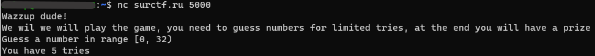
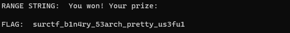

Вписываем команду в терминал и видим следующее

используем магию переводчика или свой _вери велл_ инглиш, понимаем, что нам надо угадать числа
Если начем делать это собственноручно, то вскоре осознаем, что на это уйдет слишком много времени.

Поэтому придется написать скрипт  
~~преодолев отвращение и боль открываем любой IDE, где есть Python~~  

Я набросал вот это:  
[solver.py](./attachments/solver.py)  

``` python
from operator import contains
import pwn

conn = pwn.remote('surctf.ru', 5000)
conn.recvlines(2)

while True:
    recv = conn.recvline().decode('utf-8')
    print("RANGE STRING: ", recv)
    
    if contains(recv, 'won'):
        recv = conn.recvline().decode('utf-8')
        print("FLAG: ", recv)
        exit()

    splited = recv.split()

    left = int(splited[-2][1:-1])
    right = int(splited[-1][:-1])
    print(f"Left: {left}, right {right}")

    conn.recvline()
    while True:
        current = (left+right)//2
        conn.sendline(str(current).encode('utf-8'))
        print("SENT TO SERVER: ", str(current))

        recv = conn.recvline().decode('utf-8')
        print("GOT FROM SERVER: ", recv)

        if contains(recv, 'small'):
            left = current + 1
        elif contains(recv, 'much'):
            right = current - 1
        else:
            break

```

Скрипт недолго выводит всякий отладочный мусор и вскоре мы увидим наш заветный флаг:


> surctf_b1n4ry_53arch_pretty_us3fu1