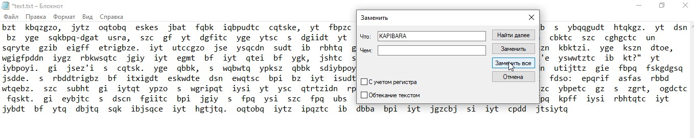

Качаем [текст](attachments/text.txt) , открываем его, видим кучу капибары:

__1.УДАЛЯЕМ ВСЮ КАПИБАРУ  : D__  

__2.Заходим на [Substitution Solver](https://guballa.de/substitution-solver), и вводим туда полученный текст:__  
2.1.Выбираем Энглиш  
2.2.Нажимаем кнопку __бреак шифер__  
2.3.Получаем такой текст:  
> one  morning,  when  gregor  samsa  woke  from  troubled  dreams,  he  found  himself  transformed  in  his  bed  into  a  horrible  vermin.  he  lay  on  his  armour-like  back,  and  if  he  lifted  his  head  a  little  he  could  see  his  brown  belly,  slightly  domed  and  divided  by  arches  into  stiff  sections.  the  bedding  was  hardly  able  to  cover  it  and  seemed  ready  to  slide  off  any  moment.  his  many  legs,  pitifully  thin  compared  with  the  size  of  the  rest  of  him,  waved  about  helplessly  as  he  looked.  "what's  happened  to  me?"  he  thought.  it  wasn't  a  dream.  his  room,  a  proper  human  room  although  a  little  too  small,  lay  peacefully  between  its  four  familiar  walls.  a  collection  of  textile  samples  lay  spread  out  on  the  table  -  samsa  was  a  travelling  salesman  ___flag:  surctf  kafka  cool  person___.  and  above  it  there  hung  a  picture  that  he  had  recently  cut  out  of  an  illustrated  magazine  and  housed  in  a  nice,  gilded  frame.  it  showed  a  lady  fitted  out  with  a  fur  hat  and  fur  boa  who  sat  upright,  raising  a  heavy  fur  muff  that  covered  the  whole  of  her  lower  arm  towards  the  viewer.  gregor  then  turned  to  look  out  the  window  at  the  dull  weather

2.4.Читаем текст, находим флаг (выделил в тексте), расставляеи нижнее подчеркивания.  
__3.Получаем флаг и вводим его__  
> flag: __surctf_kafka_cool_person__  

__4.Радуемся профиту!!!__  
