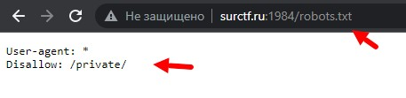

__1.Смотрим robots.txt:__  
  
1.1.В запретах для роботов видим директорию /private, переходим в неё и получаем первый флаг:  
  
__2.Радуемся что нашли флаг:__  
>flag: _surctf_w3_ar3_the_r0bots_  
