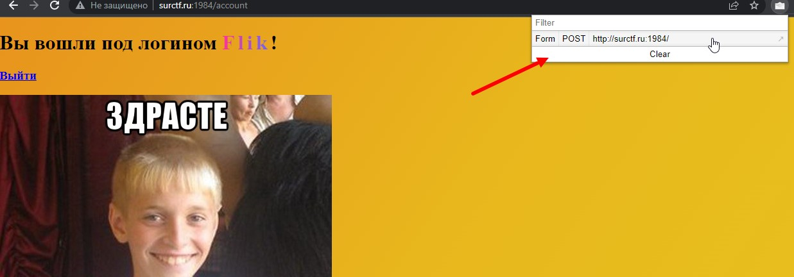
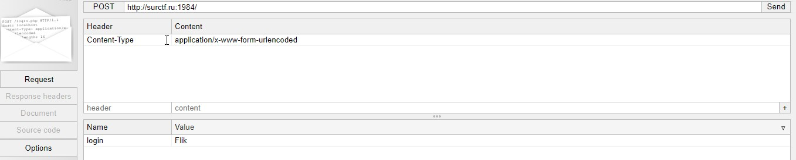
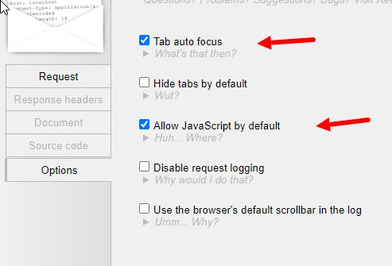
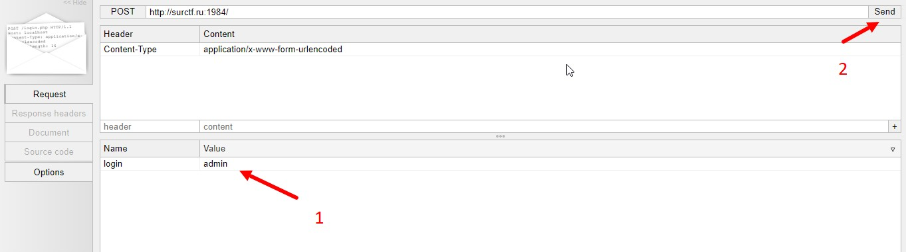
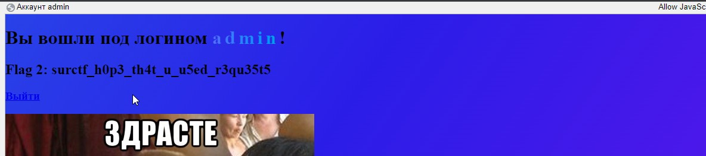

Скачиваем плагины [Request Maker](https://chrome.google.com/webstore/detail/request-maker/kajfghlhfkcocafkcjlajldicbikpgnp?hl=ru) и [EditThisCookie](https://chrome.google.com/webstore/detail/editthiscookie/fngmhnnpilhplaeedifhccceomclgfbg?hl=ru)  
__1.Заходим на [сайт](http://surctf.ru:1984/), и входим в любой аккаунт.__  
1.1.Открываем Request Maker , открываем запрос входа:   
  
1.2.Открываем настройки и ставим две галочки :  
  
1.3.Возвращяемся в _Request_, меняя значение login : (имя_пользователя) на login : admin и нажимаем send:  
__2.Получаем второй флаг.__  
  
> flag: _surctf_h0p3_th4t_u_u5ed_r3qu35t5_  
