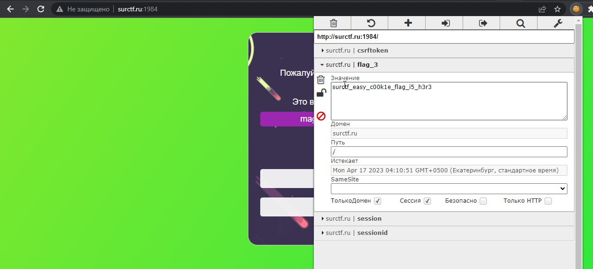

__1.После того как вы выполнили второе задание , вам отправляются coockie файлы с 3-ем флагом.__  
1.1.Заходим на [сайт](http://surctf.ru:1984/), открываем плагин [EditThisCookie](https://chrome.google.com/webstore/detail/editthiscookie/fngmhnnpilhplaeedifhccceomclgfbg?hl=ru), там открываем значение *flag_3*:  
  
__2.Профит 3-ий флаг у нас.__
> flag: *surctf_easy_c00k1e_flag_i5_h3r3*
