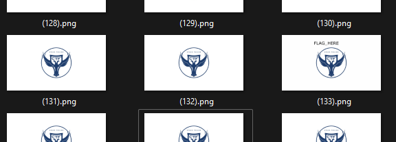

Распаковываем архив, видим множество картинок  
Одна из них ```(133).png``` отличается от остальных:  
  

  
  
Открываем её в __stegsolve__, замечаем точки на blue, green и red plane:  
  
идем в меню data extract, выбираем нулевые биты blue, green и red, получаем флаг:  
  

> surctf_lsb_is_cool
