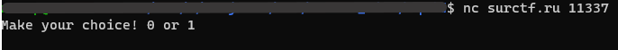
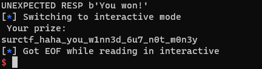

Видим nc, значит вводим в терминал всю команду из задания целиком и ждем чуда...  
  
Чуда не произошло, но мы видим пришлашение выбрать 0 или 1  

Подбирать их вручную конечно же весело, но слишком долго, поэтому напишем скрипт для автоматизации процесса
[solver.py](./attachments/solver.py)
> это был второй таск, который мне пришлось решать на питоне, поэтому ненависть к этому языку поубавилась

Если вдруг лень переходить по ссылке выше, то держите:
``` python
from operator import contains
import pwn

known_str = ""
i = 0;
last_val = True

while True:
        conn = pwn.remote('surctf.ru', 11337)
        try:
            while True:
                resp = conn.recvuntil("Make your choice! 0 or 1\n")
                if i < len(known_str):
                    conn.sendline(known_str[i].encode('utf-8'))
                    print('Sent ', known_str[i], i)
                    resp = str(conn.recvuntil('!'));
                    print(resp)
                    if contains(resp, 'Nice'):
                        i += 1
                        print('ok, next')
                    else:
                        print('SOMETHING WRONG')
                        exit(0)
                else:
                    conn.sendline(str(int(last_val)).encode('utf-8'))
                    resp = str(conn.recvuntil('!'));
                    if contains(resp, 'Nice'):
                        i += 1
                        known_str += str(int(last_val))
                        print(i ,' got new data', known_str)
                    elif contains(resp, 'Wrong'):
                        print('We fucked up on ', i, ' with val ', last_val)
                        last_val = not(last_val)
                        i = 0
                        break
                    else:
                        print("UNEXPECTED RESP", resp)
        except Exception as e:
                conn.interactive()
        finally:
                conn.close()
```

Ждем пару часов и видим:  


Для самых нетерпеливых
> surctf_haha_you_w1nn3d_6u7_n0t_m0n3y