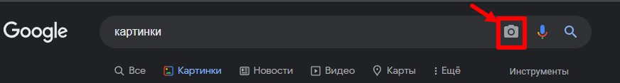
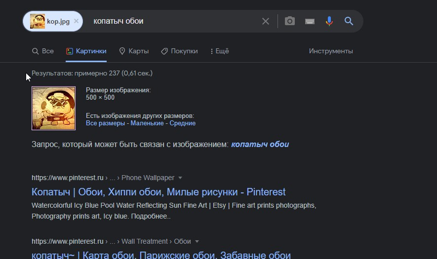
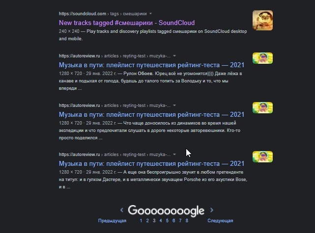
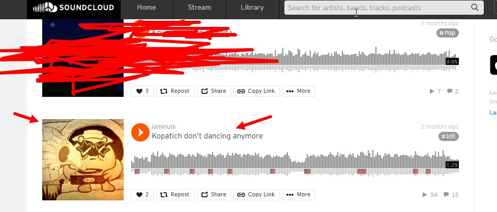
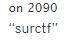
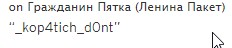

__1.Заходим в гугл__  
1.1.Вводим что либо в гугле (без разницы), открываем раздел картинки  
1.2.У нас появится значок фотоаппарата  
  
1.3.Нажимаем и скидываем туда нашу картинку.  
1.4.Заходим в раздел "всё" и ищем нашу картинку , __(Не забывайте про страницы в гугле ,т.к нужный нам сайт может быть и на 2,3,4 и т.д. странице.)__
__2.Фото объяснение:__  
2.1: Загружаем картинку:   
2.2: Ищем нашу картинку в инете(У меня она была на 3-ей странице):   
2.3: Заходим и видим что это музыка,переходим по ней:   
2.4: Заходим в профиль автора:   
2.5: Открываем последние коментарии, листаем в самый вниз и потихоньку поднимаясь вверх видим части флага:   
2.6: 1 часть:   
2.7: 2 часть:   
2.8: 3 часть:   
__3.Совмещаем части и получаем флаг:__  
> flag: surctf_kop4tich_d0nt_dancing_anymore_l0l

