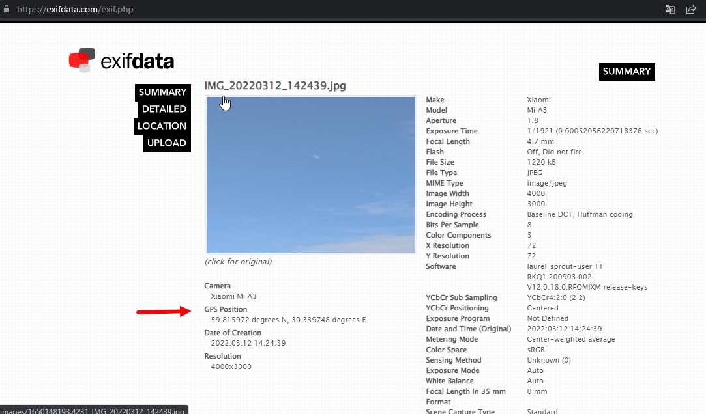
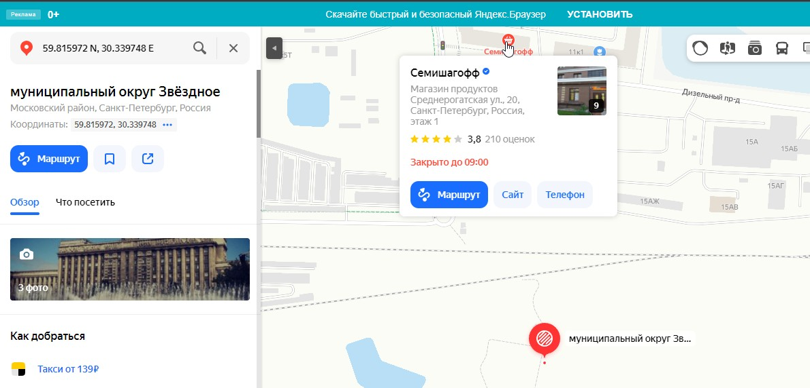
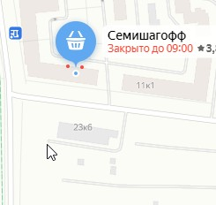
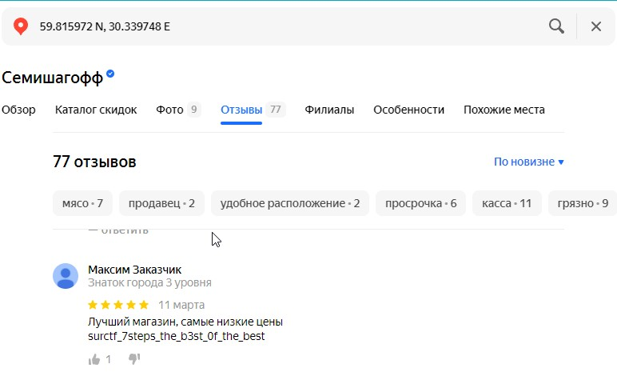

Качаем [фото](https://drive.google.com/file/d/1B8qmaIvU0DRYQVyBNAWxZMzZqg4qfmut/view?usp=sharing)  
Открываем любой сайт где можно достать мета-данные файла к примеру [exifdata](https://exifdata.com/exif.php)  
__1. Загружаем наше фото и смотрим координаты:__  
  
__2. Открываем яндекс карты , именно их т.к магазина который мы ищем в гугле нет__  
2.1: Вводим в поиск наши координаты:   
2.2: Рядом есть магазин "Семишагофф"  
  
2.3: Заходим и читаем отзывы к нему.  
__3.Находим флаг, радуемся__  

>flag: surctf_7steps_the_b3st_0f_the_best