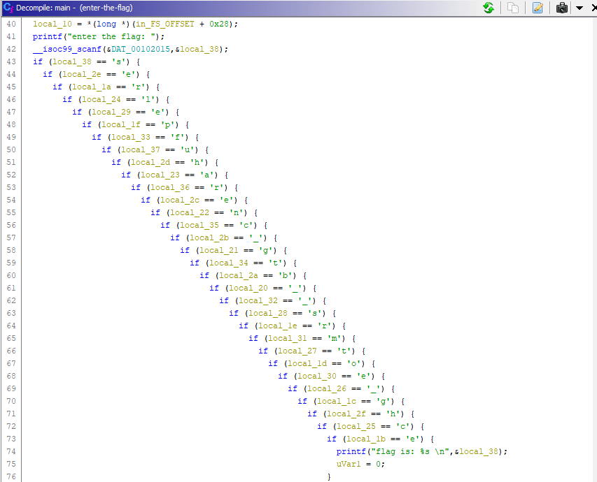

Вот тут уже реально интересно, не то, что в первом задании по __#REVERSE__

Открываем и анализируем наш файл в Ghidr`е

Видим много ветвлений if, догадываемся расположить условия в порядке убывания переменных local_xx:

Убираем лишнее, получаем флаг:
> surctf_mehehe_best_clang_proger