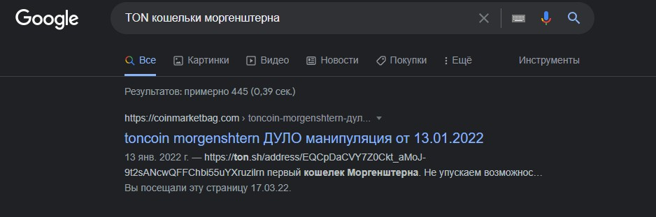
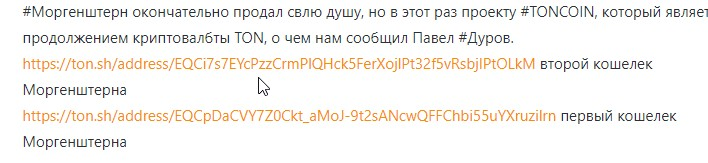
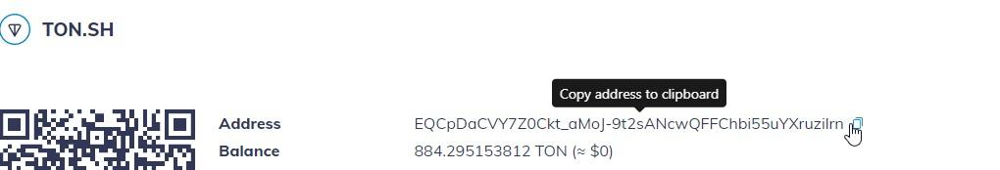
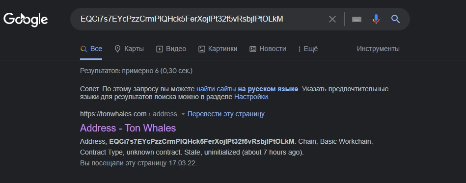
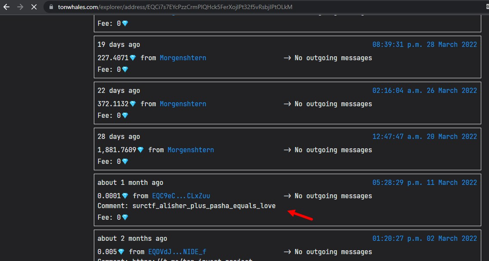

__1.Ищем TON Кошельки Моргенштерна:__  
1.1:   
1.2: У меня на первом же сайте есть верные кошельки:   
>https://ton.sh/address/EQCpDaCVY7Z0Ckt_aMoJ-9t2sANcwQFFChbi55uYXruzilrn первый кошелек Моргенштерна  

>https://ton.sh/address/EQCi7s7EYcPzzCrmPlQHck5FerXojlPt32f5vRsbjIPtOLkM второй кошелек Моргенштерна

1.3: Заходим по ссылкам и копируем сами адреса:   
  

1.4: По очереди вбиваем их в гугл:   
P.S Нам нужен именно tonwhales.com , т.к он показывает комментарии к транзакциям , увы у второго кошелька в поиске нет tonwhales.com , поэтому делаем всё с первым.  
1.5: Заходим на первую ссылку (https://tonwhales.com/explorer/address/EQCi7s7EYcPzzCrmPlQHck5FerXojlPt32f5vRsbjIPtOLkM) и листаем немного вниз , к транзациям.  
1.6: Видим наш флаг :   
__2.Флаг найден , радуемся :D__  
> flag: surctf_alisher_plus_pasha_equals_love
