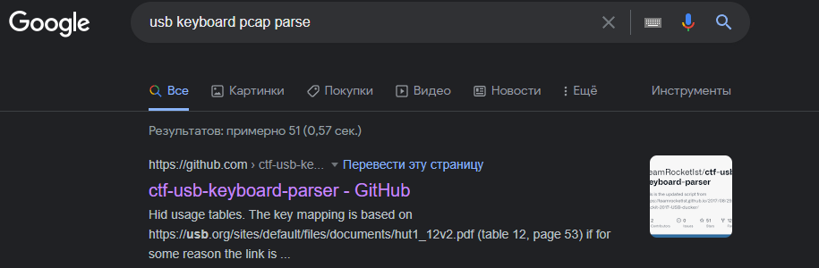

Открываем файл Wireshark`ом, но ничего внятного не замечаем, какие-то бессмысленные на первый взгляд потоки данных  
Из текста таска и названия файла понимаем, что это захват данных от usb клавиатуры  
Гуглим парсер pcap файлов захвата с usb клавиатуры и сразу же натыкаемся на подходящий [репозиторий](https://github.com/TeamRocketIst/ctf-usb-keyboard-parser) с инструкцией:  
  
Следуем описанному там алгоритму, но следует отметить, что в новых версиях tshark параметры, где есть __usb.capdata__ нужно заменить на __usbhid.data__  
``` проверьте содержимое выходного файла после выполнения tshark, если он пустой, то выполните замену как описано выше, если же он не содержит двоеточий между байтами, то необходимо добавить sed как написано в репозитории с инструкцией ```
Получим что-то подобное:  
  
``` если ничего не вывелось, то, скорее всего, вы поленились прочитать мои поянения выше ```
К сожалению это еще не всё...  
Нужно догадаться сделать последнюю __E__ строчной  
Вот теперь всё.  
> surctf_wireshark_thats_s0_G0O0D_USBanalyzere