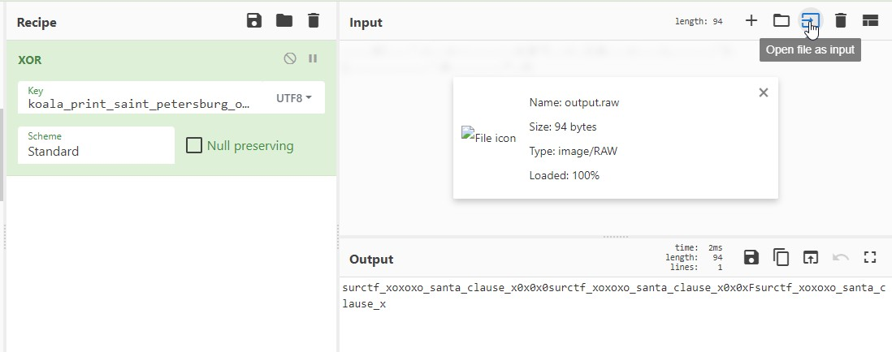

__1.Скачиваем [input](https://filebin.ca/6d0ew5Nz9qUm/input.txt) и [output](https://filebin.ca/6d0fKkd72GrM/output.raw)__  
1.1.Заходим на [КуберШеф](https://gchq.github.io/CyberChef/)  
__2.Начинаем расшифровывать__  
2.1.Добавляем в рецепт __XOR__  
2.2.В _input_ грузим файл output.raw  
2.3._Key_ устанавливаем как UTF-8, и вводим в него наш input.txt  
2.4.По логике убираем всё лишнее и флаг готов.  
  
__3.Вводим флаг , профит :D__
> flag: *surctf_xoxoxo_santa_clause_x0x0x0*
